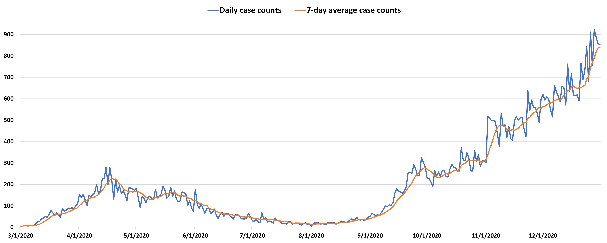

# Forecasting-COVID-19-using-Deep-Learning
### CODE UPLOAD IN PROGRESS 🚨🚨🚨
### Abstract : 
Provincial health care systems are in need of forecasting models to combat viral infectious
diseases such as COVID-19, which can estimate changes in the number of cases in advance.
This information can be used to alert policymakers and health care management to understand
the changes in a pandemic and to estimate the future demand for health services. This
study uses machine learning and deep learning methods to determine the most important
variables responsible for the transmission of the virus and to predict daily or 7-day moving
average case counts up to one week in advance.

Data was collected and prepared into daily records containing the number of new COVID
case counts, demographic data on those found positive with COVID, outdoor weather variables,
indoor environmental variables; and human movement data based on cellular mobility,
and public health care restriction data. Inductive Decision Tree (IDT) models were developed
and tested to analyze variable importance and to determine the typical manner in
which these variables interacted to predict daily case counts. Indoor relative humidity was
found to be an important factor not typically considered in such studies.

Predictive models were then developed using two deep neural network approaches: Convolutional
Neural Networks (CNN) and Long Short-Term Memory (LSTM) neural networks.
A 5-fold chronological cross-validation approach was used to develop these models. The best
LSTM models forecasted tomorrow’s daily COVID case counts with 90.7% accuracy, and the
7-day rolling average COVID case counts with 98.1% accuracy using the test set data. We
also developed LSTM models to forecast the next 7 days of daily COVID case counts. The
best models were able to predict the Daily case counts of the test set with a mean accuracy
of 90.5% over all days with the lowest accuracy of 91.4% on the first day predict. Models
forecasting the 7-day rolling average case counts had a mean accuracy of 92.5%, and 94.3% 
on first day (D+1) on the same test set.

